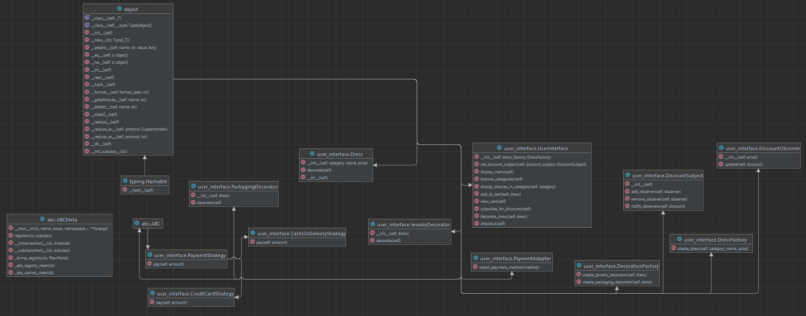

# final_project_sdp
# Comprehensive Project Documentation

### Project Overview

Zaida Dress is an online platform that allows users to explore and purchase different categories of dresses. The project focuses on demonstrating the implementation of various design patterns to enhance flexibility, maintainability, and extensibility.

## Features

### Browse Categories

Users can explore three main dress categories: Evening Dresses, Wedding Dresses, and Party Dresses. The user interface guides users through the category selection process, allowing them to view and choose dresses from their preferred category.

### Subscribe for Discounts

The subscription feature enables users to receive notifications about available discounts. The Observer Pattern is employed to implement this feature, with users acting as observers and the discount system as the subject.

### View Cart

Users can add dresses to their shopping cart, and the system provides a detailed view of the cart contents. Decorations can be added to dresses, and the total price is calculated dynamically.

### Checkout

The checkout process involves selecting a payment method, such as Credit Card, Kaspi, or Cash on delivery. The Strategy Pattern is utilized to switch between different payment methods seamlessly.

## Design Patterns

### Singleton Pattern

The Singleton Pattern ensures that the `DiscountSubject` is a single, globally accessible instance. This guarantees that discount notifications are consistent across the entire application.

### Strategy Pattern

The Strategy Pattern is implemented in the `PaymentAdapter` to handle various payment methods. Each payment method is encapsulated in a separate strategy class, providing a flexible and interchangeable solution.

### Factory Method Pattern

The `DressFactory` class employs the Factory Method Pattern to create instances of different dresses based on user input. This pattern allows the system to instantiate dresses without specifying their concrete classes.

### Decorator Pattern

Decorations, such as jewelry and packaging, are implemented using the Decorator Pattern. Users can choose and combine different decorations to enhance their selected dresses.

### Observer Pattern

The Observer Pattern facilitates the subscription feature. The `DiscountSubject` maintains a list of observers (`DiscountObserver`), and when discounts are available, it notifies all registered observers.

### Adapter Pattern

The Adapter Pattern is applied in the `PaymentAdapter` to create a uniform interface for various payment methods. This allows the system to support multiple payment gateways without modifying existing code.

## Conclusion

The Zaida Dress Online Dress Shop project effectively utilizes a variety of design patterns to create a modular, extensible, and maintainable system. Each pattern serves a specific purpose, contributing to the overall efficiency and flexibility of the application.

